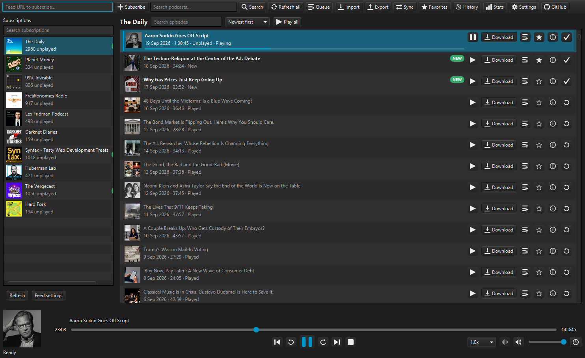
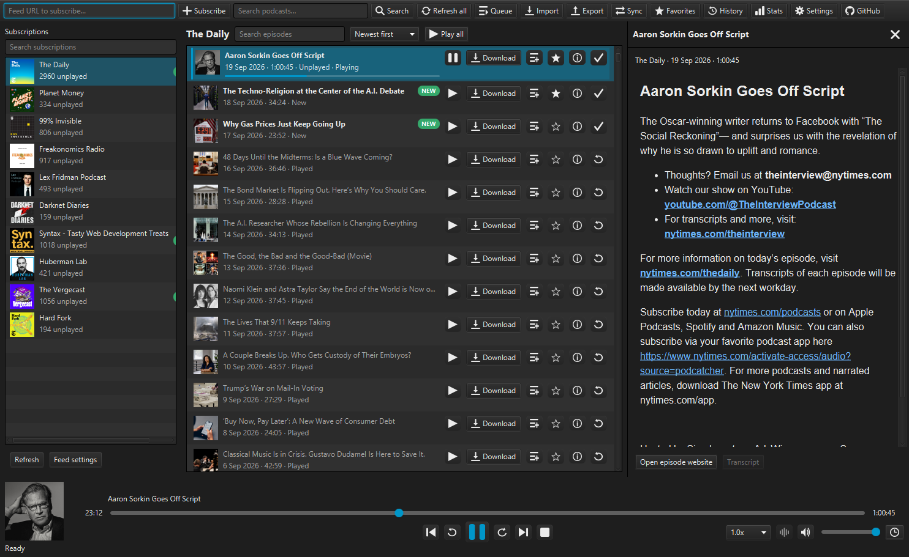
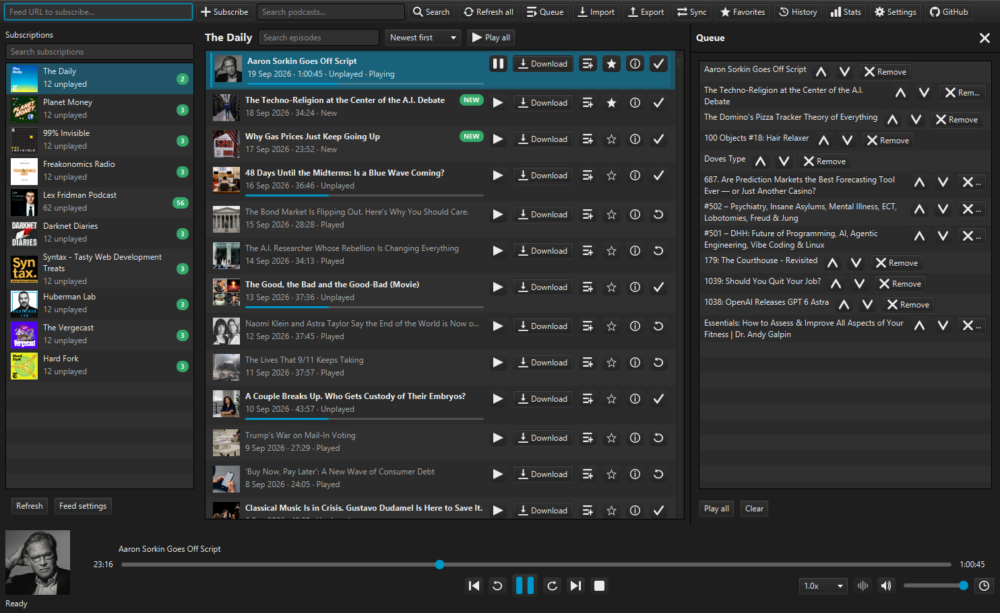
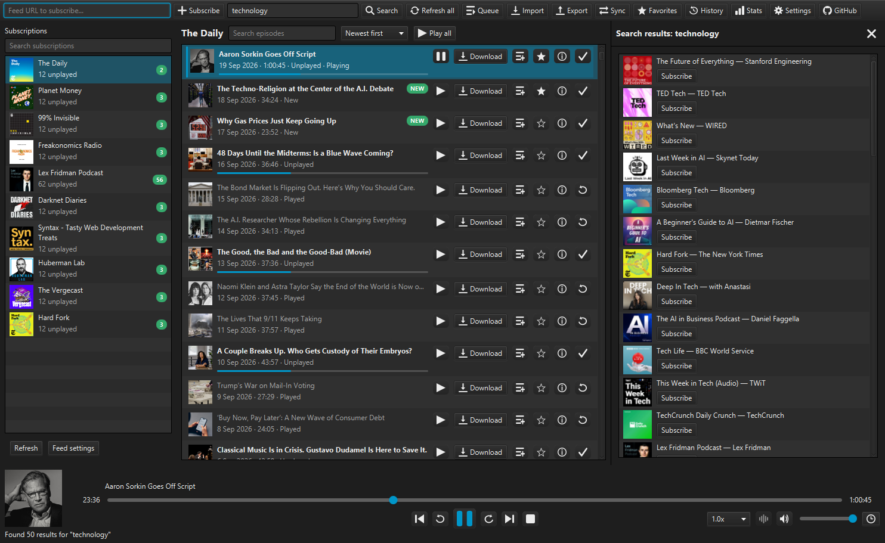
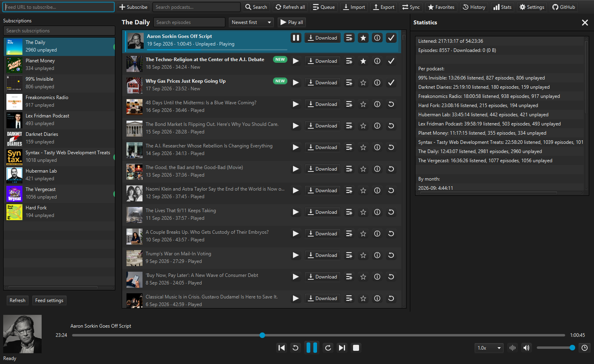
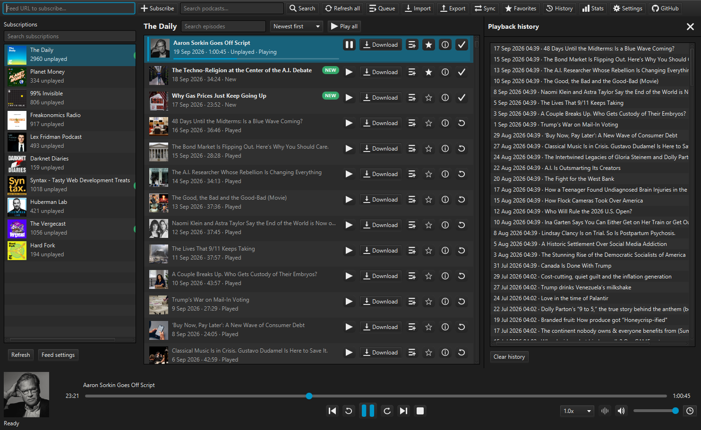
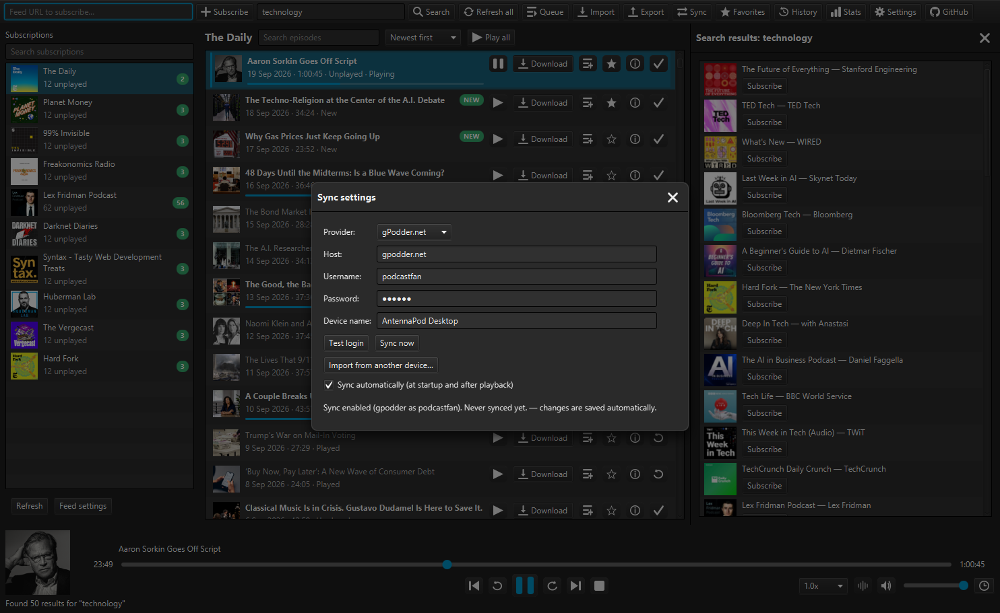

# AntennaPod Desktop for Windows

A native Windows port of [AntennaPod](https://github.com/AntennaPod/AntennaPod),
the open-source podcast manager. Same core engine (feed parser, search, sync),
rebuilt as a Windows desktop app with its own Java runtime bundled — no
installation of Java or anything else required.



## Download

From the [**Releases page**](https://github.com/artanvrajolli/AntennaPod-Desktop/releases)
(Windows 10/11, 64-bit):

- **Installer (recommended)** — run `AntennaPod-Desktop-Setup-*.exe`, then start
  AntennaPod Desktop from the Start menu. Per-user install in
  `%LOCALAPPDATA%\AntennaPod-Desktop`, no admin rights needed.
- **Portable** — unzip `AntennaPod-Desktop-Windows.zip` anywhere and run
  `AntennaPod-Desktop.exe`.

Your data (subscriptions, downloads, playback positions) lives in
`%APPDATA%\AntennaPod`, so both ways share the same library.

## Features

- Subscribe by URL, OPML import/export (+ HTML export), podcast search
  (Apple, fyyd, Podcast Index) with cover art in results
- Streaming + downloads with progress, per-feed auto-download rules and
  auto-delete after playing
- Playback queue, per-feed sort orders, ▶ Play-all from oldest to newest
- Sleep timer, per-feed playback speed, skip intro/ending, volume boost,
  one-click **skip silence** toggle in the player bar, favorites, chapters,
  transcripts (SRT/VTT/JSON), shownotes
- Playback history, listening statistics, system-tray integration with
  compact icon playback controls (right-click the tray icon)
- Progress bars show a ghost marker at the last position saved to your sync
  provider, and playback duration fixes keep gPodder.net episode actions clean
- Search/filter your subscriptions and episodes, light/dark/system theme
  (follows the Windows app theme by default)
- **Sync** with gPodder.net and Nextcloud (two-way subscriptions, positions,
  played state), including import from another device
- Windows integration: the keyboard's media keys work from any window, the
  taskbar button shows playback progress and the episode's artwork, and
  previous, play/pause, next and skip-silence buttons sit under the taskbar
  thumbnail
- Keeps running in the tray when the window is closed (configurable), resumes
  a stream that stops before the episode is over, and keeps a temporary copy
  of the playing and next queued episode, dropped once it is played
- Preview a podcast's details and episodes before subscribing
- Checks GitHub for a newer release and installs it (can be switched off in
  Settings)

## Screenshots

| | |
|---|---|
|  |  |
|  |  |
|  |  |

More: [favorites](docs/screenshots/favorites.png) ·
[settings](docs/screenshots/settings.png) ·
[per-feed settings](docs/screenshots/feed-settings.png)

## Sync setup

1. Open **Sync**, choose gPodder.net (host `gpodder.net`) or Nextcloud
   (your server host + an app password).
2. Enter username/password → Save → **Test login**.
3. **Sync now**. To pull subscriptions from your phone, use
   **Import from another device…** and pick it from the list.

## Build from source

Requirements: JDK 17+ (CI uses Microsoft Build of OpenJDK 21).

```bat
gradlew :core:test :app:test :app:installDist
```

Run: `app\build\install\app\bin\app.bat`, `gradlew :app:run`, or double-click
`run.bat`.

Package the portable zip and the installer (needs a JDK with `jpackage`; the
installer also needs [WiX Toolset v3](https://wixtoolset.org/) on PATH and is
built against JDK 21's installer template):

```bat
powershell -ExecutionPolicy Bypass -File packaging\windows\package.ps1
```

This is the same script the release workflows run. It reads the version from
`app/build.gradle` and writes `AntennaPod-Desktop-Windows.zip` and
`AntennaPod-Desktop-Setup-<version>.exe` to the repository root. Add
`-SkipInstaller` to build only the portable zip.

Every push to `main` builds and tests automatically; every `v*` tag publishes
a ready-to-download release.

## Project structure

- `core/` — ported AntennaPod engine (`model`, feed parser, discovery,
  gPodder/Nextcloud sync) with small JVM compatibility shims, plus desktop
  storage (SQLite), updater, downloader, episode cache and sync engine.
- `app/` — JavaFX user interface, playback manager, and the Windows shell
  integration (tray, taskbar, media keys, app-drawn title bar).

Both modules have JUnit tests (35+ test classes); `gradlew :core:test :app:test`
runs them all.

## Credits and license

Built on the excellent work of the AntennaPod contributors. This project is
licensed under the GNU General Public License v3.0 — see `LICENSE`.
