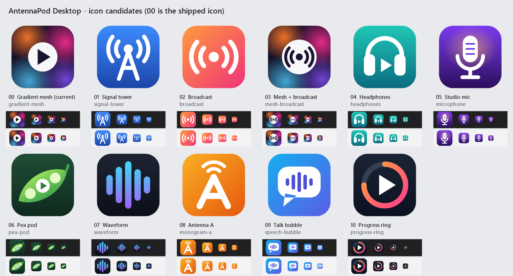

# AntennaPod Desktop app icon

The shipped icon is **gradient mesh** — a soft orange/pink/blue/violet mesh behind a
white play badge, drawn on a rounded tile.


## Files

| Path | Used for |
|------|----------|
| `app.ico` | `jpackage` — the `.exe` icon, Start-menu shortcut and installer |
| `app-icon-preview.png` | the preview above (a copy of the 256 px frame) |
| `../app/src/main/resources/icons/app-icon-{16,24,32,48,64,128,256}.png` | window/taskbar icon (JavaFX picks the right size) and the tray icon |
| `../app/src/main/resources/icons/app-icon.png` | 256 px copy for anything that wants a single file |
| `icon-designs.ps1` | every design, as drawing code, plus the shared drawing helpers |
| `candidates/` | renders of every design, for choosing a new icon |

## Regenerating

```powershell
powershell -ExecutionPolicy Bypass -File icons/generate-icons.ps1
```

Each design draws on a 512×512 virtual canvas that is scaled down, so editing a
design in `icon-designs.ps1` (colours, shape, badge) updates every size and the
`.ico` in one run. PNG frame sizes are set by `$sizes` in `generate-icons.ps1`.

## Candidates

Ten alternatives sit next to the shipped icon in `icon-designs.ps1`. Their renders
are in `candidates/`, and `candidates/contact-sheet.png` shows them all side by side,
large and at the real 48/32/24/16 px sizes on a dark and a light taskbar strip:



| # | Key | Idea |
|---|-----|------|
| 00 | `gradient-mesh` | the shipped icon |
| 01 | `signal-tower` | antenna mast with signal arcs on blue: closest to AntennaPod's own mark |
| 02 | `broadcast` | the broadcast symbol on a sunset gradient |
| 03 | `mesh-broadcast` | the shipped mesh and badge, broadcast symbol in place of play |
| 04 | `headphones` | headphones around a play triangle on teal |
| 05 | `microphone` | studio microphone on deep violet with a warm glow |
| 06 | `pea-pod` | a pod whose middle pea is a play button |
| 07 | `waveform` | rounded audio bars in a cyan-to-violet gradient on dark |
| 08 | `monogram-a` | an "A" drawn as an antenna, with signal arcs, on amber |
| 09 | `speech-bubble` | talk bubble holding a waveform |
| 10 | `progress-ring` | play triangle inside a ¾ progress ring, echoing the seek bar |

Re-render them after editing a design:

```powershell
powershell -ExecutionPolicy Bypass -File icons/generate-candidates.ps1
```

To adopt one, export it by key; this rewrites `app.ico`, the preview and the
runtime PNGs:

```powershell
powershell -ExecutionPolicy Bypass -File icons/generate-icons.ps1 -Design waveform
```

Then update the description at the top of this file. The installer's wizard
backdrop (`packaging/windows/generate-installer-bitmaps.ps1`) draws `app.ico`
over the gradient-mesh colours; rerun it after a new icon, and restyle its
glows if the new icon uses a different palette.
